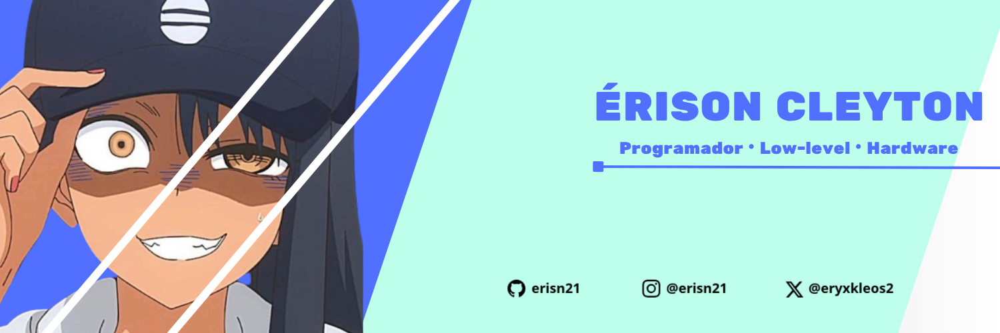

---

My passion for programming started 9 years ago, heavily inspired by the show Mr. Robot. I began writing scripts in Lua to develop mobile game cheats. A year later, I picked up C# to build basic games using the Unity engine.

Five months after that, I moved to Python, transitioning from Python 2 to 3. During this time, I built several pentesting tools and an app called "Unlock License Windows 7." Eventually, I realized Python wasn't my style. I tried C++ for a couple of months but found it too verbose and complex back then, which felt a bit frustrating.

Everything changed when I discovered C. Understanding how it operates close to the hardware fascinated me instantly. It became my primary language, and it remains the core of everything I build today.

* 🌍  I'm based in Brazil
* ✉️  You can contact me at [notyelcnosire@gmail.com](mailto:csfirmino2005@yahoo.com)
* 🧠  I'm currently learning Rust 🦀
* 👥  I'm looking to collaborate on Low-level development projects, C/Assembly tools, hardware-software integration, and experimental AI applications.
* 💬  Ask me about When I'm not coding in C or Assembly, you can find me training small AI models just for fun and curiosity.

## 💻 Core

## 💻 Scripting

## 💻 Code Editors

## 💻 Operating Systems

## Others

## Socials

 <a href="https://www.github.com/erisn21" target="_blank" rel="noreferrer"> <picture> <source media="(prefers-color-scheme: dark)" srcset="https://raw.githubusercontent.com/danielcranney/readme-generator/main/public/icons/socials/github-dark.svg" /> <source media="(prefers-color-scheme: light)" srcset="https://raw.githubusercontent.com/danielcranney/readme-generator/main/public/icons/socials/github.svg" />  </picture> </a> <a href="https://www.x.com/@Krasn4z" target="_blank" rel="noreferrer"> <picture> <source media="(prefers-color-scheme: dark)" srcset="https://raw.githubusercontent.com/danielcranney/readme-generator/main/public/icons/socials/twitter-dark.svg" /> <source media="(prefers-color-scheme: light)" srcset="https://raw.githubusercontent.com/danielcranney/readme-generator/main/public/icons/socials/twitter.svg" />  </picture> </a> <a href="https://www.threads.net/@htnysai" target="_blank" rel="noreferrer"> <picture> <source media="(prefers-color-scheme: dark)" srcset="https://raw.githubusercontent.com/danielcranney/readme-generator/main/public/icons/socials/threads-dark.svg" /> <source media="(prefers-color-scheme: light)" srcset="https://raw.githubusercontent.com/danielcranney/readme-generator/main/public/icons/socials/threads.svg" />  </picture> </a> <a href="https://discord.com/users/krasn4zeris" target="_blank" rel="noreferrer"> <picture> <source media="(prefers-color-scheme: dark)" srcset="https://raw.githubusercontent.com/danielcranney/readme-generator/main/public/icons/socials/discord-dark.svg" /> <source media="(prefers-color-scheme: light)" srcset="https://raw.githubusercontent.com/danielcranney/readme-generator/main/public/icons/socials/discord.svg" />  </picture> </a>

 

### Badges

